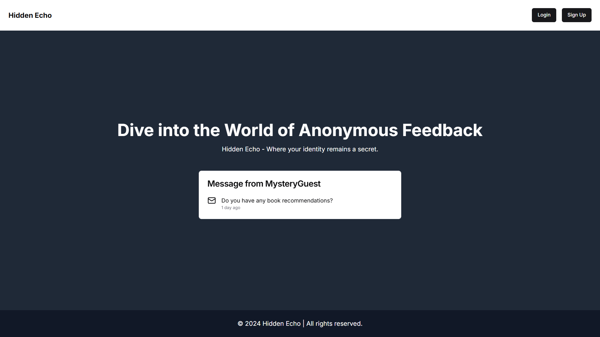

# Hidden Echo

Hidden Echo is a secure, anonymous messaging platform that prioritizes user privacy. Users are required to verify their accounts through a two-factor authentication process, ensuring the uniqueness of usernames. Once verified, users can access a personalized dashboard where they can manage URL settings, toggle message notifications, and engage in anonymous conversations with others.

## Technologies Used

- HTML
- CSS
- Javascript
- Tailwind
- Next JS
- [Resend](resend.com)

## Getting Started

This section explains how to set up your project locally for development.

### Prerequisites

Make sure you have the following installed on your local machine:

- **Node.js**: [Download and install](https://nodejs.org/)
- **npm** or **yarn**: Comes bundled with Node.js.

### Installation

To install the project, follow these steps:

1. **Clone the repository:**

   ```bash
   git clone https://github.com/debugger-snjy/Hidden-Echo
   ```

2. **Installing the Node Packages:**

   ```bash
   npm install
   ```

3. **Running the Application:**

   ```bash
   npm run dev
   ```

## Screenshots

Login Page:


